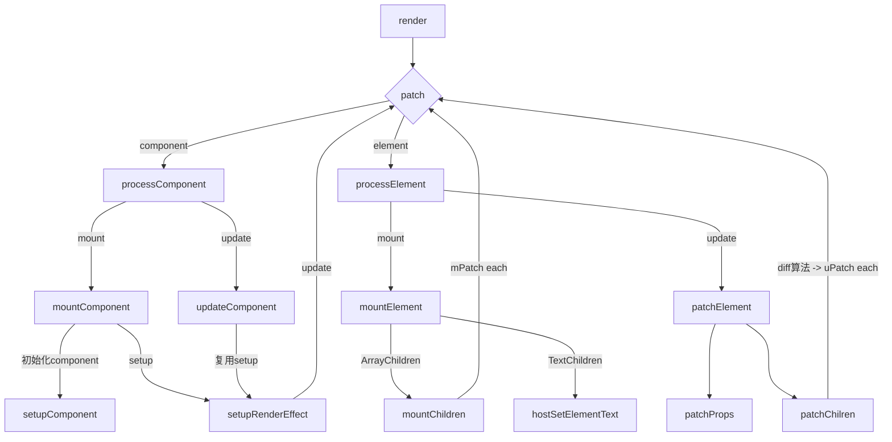

---
# try also 'default' to start simple
theme: default
# random image from a curated Unsplash collection by Anthony
# like them? see https://unsplash.com/collections/94734566/slidev
background: https://source.unsplash.com/collection/94734566/1920x1080
# apply any windi css classes to the current slide
class: "text-center"
# https://sli.dev/custom/highlighters.html
highlighter: shiki
# show line numbers in code blocks
lineNumbers: false
# some information about the slides, markdown enabled
info: |
  ## Slidev Starter Template
  Presentation slides for developers.

  Learn more at [Sli.dev](https://sli.dev)
# persist drawings in exports and build
drawings:
  persist: false
---

# 技术分享-@vue/runtime-core (ElementVnode)

<div class="pt-12">
  <span @click="$slidev.nav.next" class="px-2 py-1 rounded cursor-pointer" hover="bg-white bg-opacity-10">
    Press Space for next page <carbon:arrow-right class="inline"/>
  </span>
</div>

<div class="abs-br m-6 flex gap-2">
  <button @click="$slidev.nav.openInEditor()" title="Open in Editor" class="text-xl icon-btn opacity-50 !border-none !hover:text-white">
    <carbon:edit />
  </button>
  <a href="https://github.com/slidevjs/slidev" target="_blank" alt="GitHub"
    class="text-xl icon-btn opacity-50 !border-none !hover:text-white">
    <carbon-logo-github />
  </a>
</div>

<!--
The last comment block of each slide will be treated as slide notes. It will be visible and editable in Presenter Mode along with the slide. [Read more in the docs](https://sli.dev/guide/syntax.html#notes)
-->

---

# Vue3 项目拆分

<div class='flex justify-center'>
  <div class='flex flex-col space-y-3 justify-center w-120'>
   <h3>编译</h3>
   <h4>@vue/complier-sfc</h4>
   <h6>处理单文件组件</h6>
   <h4>@vue/complier-dom</h4>
   <h6>底层依赖@vue/compiler-core用于将浏览器平台的template编译成render函数</h6>
   <h4>@vue/complier-core</h4>
   <h6>编译核心逻辑</h6>
  </div>
  <div class='flex-col flex space-y-3 justify-center w-90'>
   <h3>运行时</h3>
   <h4>@vue/runtime-dom</h4>
   <h6>依赖@vue/runtime-core实现浏览器平台下的渲染</h6>
   <h4>@vue/runtime-core</h4>
   <h6>核心运行时逻辑</h6>
   <h4>@vue/reactivity</h4>
   <h6>实现了数据响应式</h6>
  </div>
</div>

---

# @vue/runtime-core

实现了一个**renderer**（渲染器），将虚拟 Dom 渲染为特定平台上的真实元素

<br>
<br>

**通过将渲染器设计为可配置的“通用”渲染器 我们可以实现渲染到任意目标平台上**
<br>
<br>

**日常使用的目标平台是浏览器，所以 runtime-core 包需要与 runtime-dom 配合**
<br>
<br>

**runtime-core 提供抽象能力与挂载/更新逻辑**
<br>
<br>

**runtime-dom 提供真实操作 DOM 的接口**

<br>
<br>

<!--
You can have `style` tag in markdown to override the style for the current page.
Learn more: https://sli.dev/guide/syntax#embedded-styles
-->

<style>
h1 {
  background-color: #2B90B6;
  background-image: linear-gradient(45deg, #4EC5D4 10%, #146b8c 20%);
  background-size: 100%;
  -webkit-background-clip: text;
  -moz-background-clip: text;
  -webkit-text-fill-color: transparent;
  -moz-text-fill-color: transparent;
}
</style>

---

### 实现一个最简单的渲染器组件

```vue {all|5|7-8|13-15|all}
<script setup lang="ts">
import { ref, effect } from "vue";
const app = ref(null);
const count = ref(0);
const renderer = (domString, container) => {
  if (container.value) {
    //配合@vue/runtime-dom调用浏览器api
    hostSetInner(container.value, domString);
  }
};
const countAdd = () => count.value++;
const hostSetInner = (el, content) => (el.innerHTML = content);
effect(() => {
  // 配合@vue/reactivity响应式更新数据
  renderer(`<h1>count: ${count.value}</h1>`, app);
});
</script>
<template>
  <div ref="app"></div>
  <div @click="countAdd">Add</div>
</template>
```

<Renderer />
<v-click>
<p>利用响应系统的能力，自动调用渲染器完成页面的渲染和更新</p>
</v-click>
---

# VNode

```ts
export function createVnode(type, props?, children?) {
  const vnode = {
    type,
    props,
    children,
  };
  return vnode;
}
```

```ts
// Element VNode (tagName: string, props: Object, children:string | Array)
createVnode("div", { id: "app" }, "Element Example");
// Component VNode (Component, props: Object, slots: Object)
// Component with setup() and render()
createVnode(
  Foo,
  {
    onChangeChange(a, b) {
      console.log("onChangeChange", a, b);
    },
  },
  {
    header: ({ age }) => h("p", {}, "123" + age),
  }
);
```

---

# 主流程

<div class='flex justify-center'>



</div>

---

# ShapeFlag

将 vnode 分类

<div grid="~ cols-2 gap-4">

<div>

```ts
// Shared/ShapeFlag.ts
export const enum ShapeFlags {
  ELEMENT = 1, // 0001
  STATEFUL_COMPONENT = 1 << 1, // 0010
  TEXT_CHILDREN = 1 << 2, // 0100
  ARRAY_CHILDREN = 1 << 3, // 1000
  SLOT_CHILDREN = 1 << 4, // 10000
}
// Inside createVnode
function getShapeFlag(type) {
  return typeof type === "string"
    ? ShapeFlags.ELEMENT
    : ShapeFlags.STATEFUL_COMPONENT;
}
if (typeof children === "string") {
  vnode.ShapeFlag |= ShapeFlags.TEXT_CHILDREN;
} else if (Array.isArray(children)) {
  vnode.ShapeFlag |= ShapeFlags.ARRAY_CHILDREN;
}
if (vnode.ShapeFlag & ShapeFlags.STATEFUL_COMPONENT) {
  if (typeof children === "object") {
    vnode.ShapeFlag |= ShapeFlags.SLOT_CHILDREN;
  }
}
```

</div>

<div>
<p>
位运算的｜操作可用于赋值
</p>
<p>
00010 | ShapeFlag.SLOT_CHILDREN => 10010
</p>
<br/>
<br/>
<p>
位运算的&操作可用于查找
</p>
<p>
00010 & ShapeFlag.SLOT_CHILDREN => 0
<br/>
10010 & ShapeFlag.SLOT_CHILDREN => 1
</p>
<br/>
<br/>

```ts
if (vnode.ShapeFlag & ShapeFlags.SLOT_CHILDREN) {
  normalizeObjectSlots(children, instance.slots);
}
```

</div>

</div>

---
clicks: 8
---

# Mount Element Vnode

<div grid='~ cols-2 gap-4'>
<div>

```ts{all|4|6|7|9|11|16|19|all}
processElement(null, n2, container); // n1为空，执行挂载逻辑

function mountElement(vnode, container, parentComponent, anchor) {
  const el = (vnode.el = hostCreateElement(vnode.type));
  const { children, ShapeFlag } = vnode;
  if (ShapeFlag & ShapeFlags.TEXT_CHILDREN) {
    hostSetElementText(el, children);
  }
  if (ShapeFlag & ShapeFlags.ARRAY_CHILDREN) {
    // 把Children中的每个VNode再次丢进patch中
    mountChildren(children, el, parentComponent, anchor);
  }
  const { props } = vnode;
  for (const key in props) {
    const val = props[key];
    hostPatchProp(el, key, null, val);
  }
  // container.insertBefore(el, anchor || null);
  hostInsert(el, container, anchor);
}
```

</div>
<div>
<div v-click="1">
<div>创建新元素并且挂载在vnode.el上</div>
<br/>
<div>hostCreateElement:document.createElement(type)</div>
</div>
<br/>
<br/>
<div v-click="2">如果Children是文字</div>
<br/>
<div v-click="3">el.textContent = children</div>
<br/>
<br/>
<div v-click="4">如果Children是Array</div>
<br/>
<div v-click="5">将每个Child丢进patch中挂载</div>
<br/>
<br/>
<div v-click="6">处理props中的每个prop</div>
<br/>
<br/>
<div v-click="7">将元素挂载到container上</div>
</div>
</div>

---

clicks: 8
---
# PatchProp

<div grid='~ cols-2 gap-4'>
<div>

```ts{all|2|3-4|5-6|7-14|17|18-19|20-21|all}
function patchProp(el, key, preVal, nextVal) {
  if (isOn(key)) {
    const invokers = el._vei || (el._vei = {});
    const existingInvoker = invokers[key];
    if (nextVal && existingInvoker) {
      existingInvoker.value = nextVal;
    } else {
      const eventName = key.slice(2).toLowerCase();
      if (nextVal) {
        const invoker = (invokers[key] = nextVal);
        el.addEventListener(eventName, invoker);
      } else {
        el.removeEventListener(eventName, existingInvoker);
        invokers[key] = undefined;
      }
    }
  } else {
    if (nextVal === null || nextVal === "") {
      el.removeAttribute(key);
    } else {
      el.setAttribute(key, nextVal);
    }
  }
}
```

</div>
<div>
<div v-click="1">
如果这个props代表事件

```ts
export const isOn = (key) => /^on[A-Z]/.test(key);
```

</div>
<br/>
<div v-click="2">
将_vei对象绑定到实例上，并取出对应的Invoker
</div>
<br/>
<div v-click="3">
如果这个事件已经储存过，并且有新的值传入，则直接更新事件
</div>
<br/>
<div v-click="4">
否则，有新的值传入则储存这个事件并添加绑定，没有则清空_vei中这个事件的值并解绑
</div>
<br/>
<br/>
<div v-click="5">
如果这个prop代表属性
</div>
<br/>
<br/>
<div v-click="6">
没有则清空属性
</div>
<br/>
<br/>
<div v-click="7">
有值则重新赋值
</div>

</div>
</div>

---
clicks: 7
---
# Update Element Vnode

<div grid='~ cols-2 gap-4'>
<div>

```ts{all|1|2|6|11|15-16|21-22|all}
import { EMPTY_OBJ } from "../shared";
processElement(n1, n2, container); //n1不为空，执行更新逻辑
function patchElement(n1, n2, container, parentComponent, anchor) {
  const oldProps = n1.props || EMPTY_OBJ;
  const newProps = n2.props || EMPTY_OBJ;
  const el = (n2.el = n1.el); //n2 新节点 没mount 无el
  patchChildren(n1, n2, el, parentComponent, anchor);
  patchProps(el, oldProps, newProps);
}
function patchProps(el, oldProps, newProps) {
  if (oldProps !== newProps) {
    for (const key in newProps) {
      const prevProp = oldProps[key];
      const nextProp = newProps[key];
      if (prevProp !== nextProp) {
        hostPatchProp(el, key, prevProp, nextProp);
      }
    }
    if (oldProps !== EMPTY_OBJ) {
      for (const key in oldProps) {
        if (!(key in newProps)) {
          hostPatchProp(el, key, oldProps[key], null);
        }
      }
    }
  }
}
```

</div>
<div>

<div v-click="1">
引入只读空对象
</div>
<br/>
<br/>
<div v-click="2">
n1不为空，执行更新逻辑
</div>
<br/>
<br/>
<div v-click="3">
n2是没有mount过的新节点，所以没有el，需先传递给n2
</div>
<br/>
<br/>
<div v-click="4">
如果新旧props不同时为空对象
</div>
<br/>
<br/>
<div v-click="5">
找出新props中值与旧props不同的部分，更新
</div>
<br/>
<br/>
<div v-click="6">
删除新props中不存在的prop
</div>

</div>
</div>

---
clicks: 5
---


# Update Element Vnode

<div grid='~ cols-2 gap-4'>
<div>

```ts{all|6-12|10-12|14-16|17-18|all}
function patchChildren(n1, n2, container, parentComponent, anchor) {
  const prevShapeFlag = n1.ShapeFlag;
  const shapeFlag = n2.ShapeFlag;
  const c2 = n2.children;
  const c1 = n1.children;
  if (shapeFlag & ShapeFlags.TEXT_CHILDREN) {
    if (prevShapeFlag & ShapeFlags.ARRAY_CHILDREN) {
      unmountChildren(n1.children);
    }
    if (c1 !== c2) {
      hostSetElementText(container, c2);
    }
  } else {
    if (prevShapeFlag & ShapeFlags.TEXT_CHILDREN) {
      hostSetElementText(container, "");
      mountChildren(c2, container, parentComponent, anchor);
    } else {
      patchKeyedChildren(c1, c2, container, parentComponent, anchor);
    }
  }
}
```

</div>
<div>
<div>
一共四种情况
</div>
<br/>
<br/>
<div v-click="1">
新的是TEXT旧的是ARRAY --> 删除旧节点并更新TEXT
</div>
<br/>
<br/>
<div v-click="2">
新旧Children都是TEXT --> 更新TEXT 
</div>
<br/>
<br/>
<div v-click="3">
新的是ARRAY旧的是TEXT --> 删除TEXT并将新的children重新mount
</div>
<br/>
<br/>
<div v-click="4">
新旧都是ARRAY --> diff算法计算出需要重新计算的节点
</div>
<br/>
<br/>
<div v-click="6">
删除新props中不存在的prop
</div>

</div>
</div>

---
clicks: 2
---

# Diff 算法

双端对比筛选相同节点

<div grid='~ cols-2 gap-4'>
<div>

<br/>
<br/>
<br/>
<div v-click='1'>

```ts
function patchKeyedChildren(c1, c2, container, parentComponent, anchor) {
  let i = 0;
  const l2 = c2.length;
  let e1 = c1.length - 1;
  let e2 = l2 - 1;
  function isSameVnodeType(n1, n2) {
    return n1.type === n2.type && n1.key === n2.key;
  }
```

</div>
</div>
<div>
<div v-click='2'>

```ts
// 筛选左侧一致元素
while (i <= e1 && i <= e2) {
  const n1 = c1[i];
  const n2 = c2[i];
  if (isSameVnodeType(n1, n2)) {
    patch(n1, n2, container, parentComponent, anchor);
  } else {
    break;
  }
  i++;
}
// 筛选右侧一致元素
while (i <= e1 && i <= e2) {
  const n1 = c1[e1];
  const n2 = c2[e2];
  if (isSameVnodeType(n1, n2)) {
    patch(n1, n2, container, parentComponent, anchor);
  } else {
    break;
  }
  e1--;
  e2--;
}
```

</div>
</div>

</div>

---
clicks: 1
---

# Diff 算法

指针溢出：代表新 children 与老 children 相比只是增加/减少了头部/尾部的元素

<div grid='~ cols-2 gap-4'>
<div>

</div>
<div>
<div v-click='1'>

```ts
// 新的比老的多 创建
if (i > e1) {
  if (i <= e2) {
    const nextPos = e2 + 1;
    const anchor = nextPos < l2 ? c2[nextPos].el : null;
    while (i <= e2) {
      patch(null, c2[i], container, parentComponent, anchor);
      i++;
    }
  }
} else if (i > e2) {
  while (i <= e1) {
    hostRemove(c1[i].el);
    i++;
  }
```

</div>
</div>

</div>

---
clicks: 2
---

# Diff 算法

指针未溢出：代表中间有需要处理的 array

<div grid='~ cols-2 gap-4'>
<div>

</div>
<div>
中间数组需要进行的操作：
<br/>
<br/>
<br/>
<div v-click='1'>
<ul>
<li>找到最多不需要进行DOM操作的元素</li>
<li>patch更新所有可复用元素</li>
<li>移动剩下可复用的child</li>
<li>创建新增添的节点</li>
<li>删除不存在的节点</li>
</ul>  
</div>

</div>

</div>

<style>
  img {
    width: 90%
  }
</style>

---
clicks: 1
---

# Diff 算法

预处理中间数组，得到 newIndexMap

<div grid='~ cols-2 gap-4'>
<div>

</div>
<div>
<div v-click='1'>

```ts
let s1 = i;
let s2 = i;

let toBePatched = e2 - s2 + 1;
let patched = 0;
const keyToNewIndexMap = new Map();
const newIndexToOldIndexMap = new Array(toBePatched);
for (let i = 0; i < toBePatched; i++) newIndexToOldIndexMap[i] = 0;
for (let i = s2; i <= e2; i++) {
  const nextChild = c2[i];
  keyToNewIndexMap.set(nextChild.key, i);
}
```

</div>
</div>

</div>

<style>
  img {
    width: 90%
  }
</style>

---
clicks: 7
---

# Diff 算法

遍历 oldArray，获得 newIndexToOldIndexMap,patch 可复用元素并删除不存在的元素

<div grid='~ cols-2 gap-4'>
<div>

</div>
<div>
<div v-click='1'>

```ts{all|all|7-8|10-12|17-18|20-22|4-6|all}
let newIndex;
for (let i = s1; i <= e1; i++) {
  const prevChild = c1[i];
  if (patched >= toBePatched) {
    hostRemove(prevChild.el);
  }
  if (prevChild.key != null) {
    newIndex = keyToNewIndexMap.get(prevChild.key);
  } else {
    for (let j = s2; j <= e2; j++) {
      if (isSameVnodeType(prevChild, c2[j])) {
        newIndex = j;
        break;
      }
    }
  }
  if (newIndex === undefined) {
    hostRemove(prevChild.el);
  } else {
    newIndexToOldIndexMap[newIndex - s2] = i + 1;
    patch(prevChild, c2[newIndex], container, parentComponent, null);
    patched++;
  }
}
```

</div>
</div>

</div>

<style>
  img {
    width: 90%
  }
</style>

---
clicks: 2
---

# Diff 算法

优化处理逻辑，引入 moved 与 maxIndexSoFar，检测是否出现过移动

<div grid='~ cols-2 gap-4'>
<div>

<div>newIndexToOldIndexMap --> 用于定位不需要移动的可复用元素,从而找到需要移动的可复用元素</div>
<br/>
<ul>
<li>找到最多不需要进行DOM操作的元素</li>
<li>patch更新所有可复用元素</li>
<li>移动剩下可复用的child</li>
<li>创建新增添的节点</li>
<li>删除不存在的节点</li>
</ul>  
</div>
<div>
<div v-click='1'>

```ts
let moved = false;
let maxNewIndexSoFar = 0;
else { // newIndex存在条件分支
  if (newIndex >= maxNewIndexSoFar) {
    maxNewIndexSoFar = newIndex;
  } else {
    moved = true;
  }
  newIndexToOldIndexMap[newIndex - s2] = i + 1;
  patch(prevChild, c2[newIndex], container, parentComponent, null);
  patched++;
}
```

</div>
<div v-click='2'>
<h3>moved:完成了删除和可复用元素patch<br/><br/>not moved：完成了删除和可复用元素patch和移动</h3>
</div>
</div>

</div>

<style>
  img {
    width: 90%
  }
</style>

---
clicks: 7
---

# Diff 算法

优化处理逻辑，引入 moved 与 maxIndexSoFar，检测是否出现过移动

<div grid='~ cols-2 gap-4'>
<div>

<br/>
<div v-click='1'>获得最长递增子串，完成了找到最多不需要进行DOM操作的元素</div>
<br/>
<ul v-click='2'>
<li>moved: 剩下移动与新增节点</li>
<li>not moved: 剩下新增节点</li>
</ul>
</div>

<div>
<div>

```ts{all|1-3|8|9-10|11-14|all}
const increasingNewIndexSequence = moved
  ? getSequence(newIndexToOldIndexMap)
  : [];
let j = increasingNewIndexSequence.length;
for (let i = toBePatched - 1; i >= 0; i--) {
  const nextIndex = i + s2;
  const nextChild = c2[nextIndex];
  const anchor = nextIndex + 1 < l2 ? c2[nextIndex + 1].el : null;
  if (newIndexToOldIndexMap[i] === 0) {
    patch(null, nextChild, container, parentComponent, anchor);
  } else if (moved) {
    if (j < 0 || i !== increasingNewIndexSequence[j]) {
      console.log("移动");
      hostInsert(nextChild.el, container, anchor);
    } else {
      j--;
    }
  }
}
```

</div>
</div>

</div>

<style>
  img {
    width: 90%
  }
</style>

---

# 特殊 type 处理

实现 FragmentType 与 TextNodeType

<div grid='~ cols-2 gap-4'>
<div>

```ts
// vnode.ts
export const Text = Symbol("Text");
export const Fragment = Symbol("Fragment");

export function createTextVnode(text) {
  return createVnode(Text, {}, text);
}
```

<div>
<br/>
<br/>
<br/>
在vnode中定义特殊type
<br/>
<br/>

在 patch 中拿到 type
<br/>

<br/>
根据特殊的type做特别处理
<br/>
<br/>

不为特殊 type 的在走正常 Element / Component 流程

</div>
</div>

<div>
<div>

```ts
// renderer.ts #patch
function patch(n1, n2, container, parentComponent, anchor) {
  const { type, ShapeFlag } = n2;
  // Fragment --> 只渲染所有的children
  switch (type) {
    case Fragment:
      processFragment(n1, n2, container, parentComponent, anchor);
      break;
    case Text:
      processText(n1, n2, container);
      break;
    default:
      if (ShapeFlag & ShapeFlags.ELEMENT) {
        processElement(n1, n2, container, parentComponent, anchor);
      }
      if (ShapeFlag & ShapeFlags.STATEFUL_COMPONENT) {
        processComponent(n1, n2, container, parentComponent, anchor);
      }
      break;
  }
}
```

</div>
</div>

</div>

---

# 特殊 type 处理

实现 FragmentType 与 TextNodeType

<div grid='~ cols-2 gap-4'>
<div>

```ts
function processFragment(n1, n2, container, parentComponent, anchor) {
  // Implement
  mountChildren(n2.children, container, parentComponent, anchor);
}
function processText(n1, n2, container) {
  console.log("处理 Text 节点");
  if (n1 === null) {
    // n1 是 null 说明是 init 的阶段
    // 基于 createText 创建出 text 节点，然后使用 insert 添加到 el 内
    console.log("初始化 Text 类型的节点");
    hostInsert((n2.el = hostCreateText(n2.children as string)), container);
  } else {
    // 在不一样的时候才需要 update text
    // 这里抽离出来的接口是 setText
    // 注意，这里一定要记得把 n1.el 赋值给 n2.el, 不然后续是找不到值的
    const el = (n2.el = n1.el!);
    if (n2.children !== n1.children) {
      console.log("更新 Text 类型的节点");
      hostSetText(el, n2.children as string);
    }
  }
}
```

</div>

<div>
<div>

```ts
<template class='FragmentType'>
  <div>Child 1</div>
  <div>Child 2</div>
  <div>Child 3</div>
</template>

h(Fragment, {class: 'FragmentType'}, [
  h("div", {}, "Child 1"),
  h("div", {}, "Child 2"),
  h("div", {}, "Child 3"),
])

<div class='TextType'>
  <div>Child 1</div>
  TextChild
  <div>Child 3</div>
</div>

h("div", {class: 'FragmentType'}, [
  h("div", {}, "Child 1"),
  h(Text, {}, "TextChild"),
  h("div", {}, "Child 3"),
])
```

</div>
</div>

</div>

---

# mountComponent

```ts
function mountComponent(initialVNode: any, container, parentComponent, anchor) {
  // 初始化组件实例对象
  const instance = (initialVNode.component = createComponentInstance(
    initialVNode,
    parentComponent
  ));

  // 初始化组件配置（props 插槽） 初始化组件全局调用属性（例如 $el, $slots, $props） 
  // 调用setup函数，并将返回值做一层refProxy(为啥template里不用.value)
  setupComponent(instance);

  // 调用组件的render函数 渲染出真正的dom节点
  setupRenderEffect(instance, initialVNode, container, anchor);
}
```

---

# 补充 effect
<div grid='~ cols-2 gap-4'>
<div>

```ts
export function effect(fn, options: any  = {}) {
    const scheduler = options.scheduler
    // fn
    const _effect = new ReactiveEffect(fn, scheduler);
    extend(_effect, options)
    _effect.run();

    const runner: any = _effect.run.bind(_effect)
    runner.effect = _effect
    return runner
}
export function triggerEffects(dep) {
    for(const effect of dep) {
        if(effect.scheduler) {
            effect.scheduler()
        } else {
            effect.run()
        }
    }
}
```
</div>
<div>

```vue
<script setup lang="ts">
import { ref, effect } from "vue";
const count = ref(0);
const countAdd = () => {
    for(let i = 0; i < 100; i++) {
        count.value ++
    }
    runner()
}
const relatedValue = ref(0)
const runner = effect(() => {
    relatedValue.value += count.value
    console.log(count.value)
}, {
    scheduler: () => {
        console.log(1)
    }
})
</script>
```
<Effect />

</div>
</div>